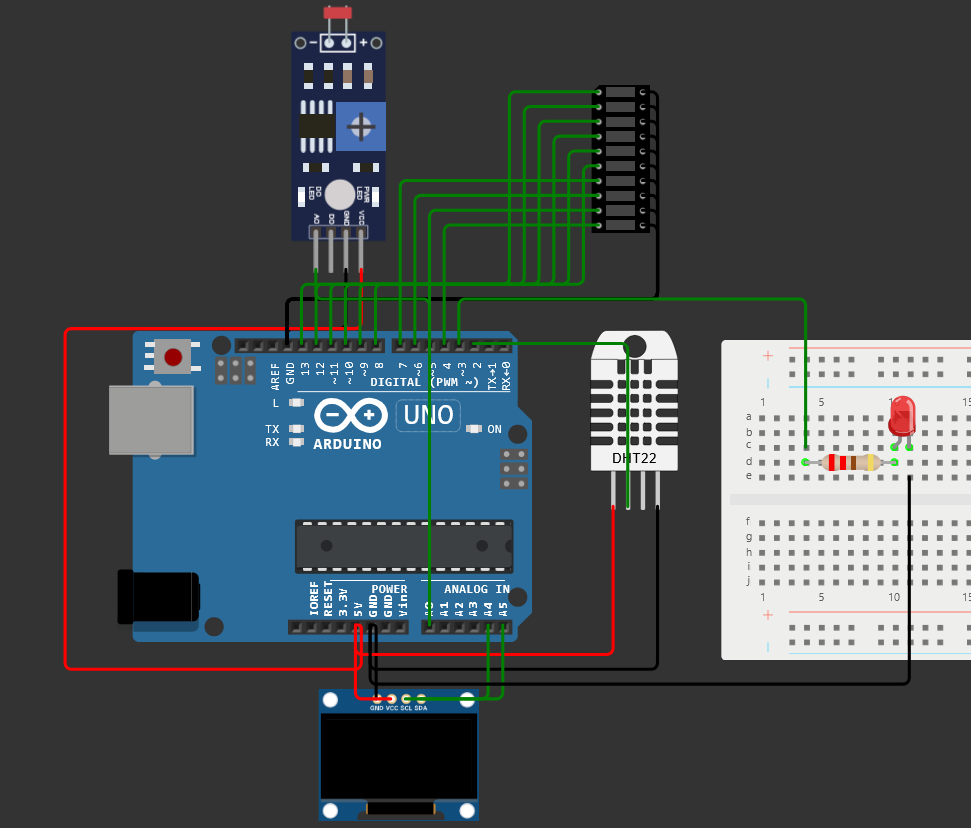
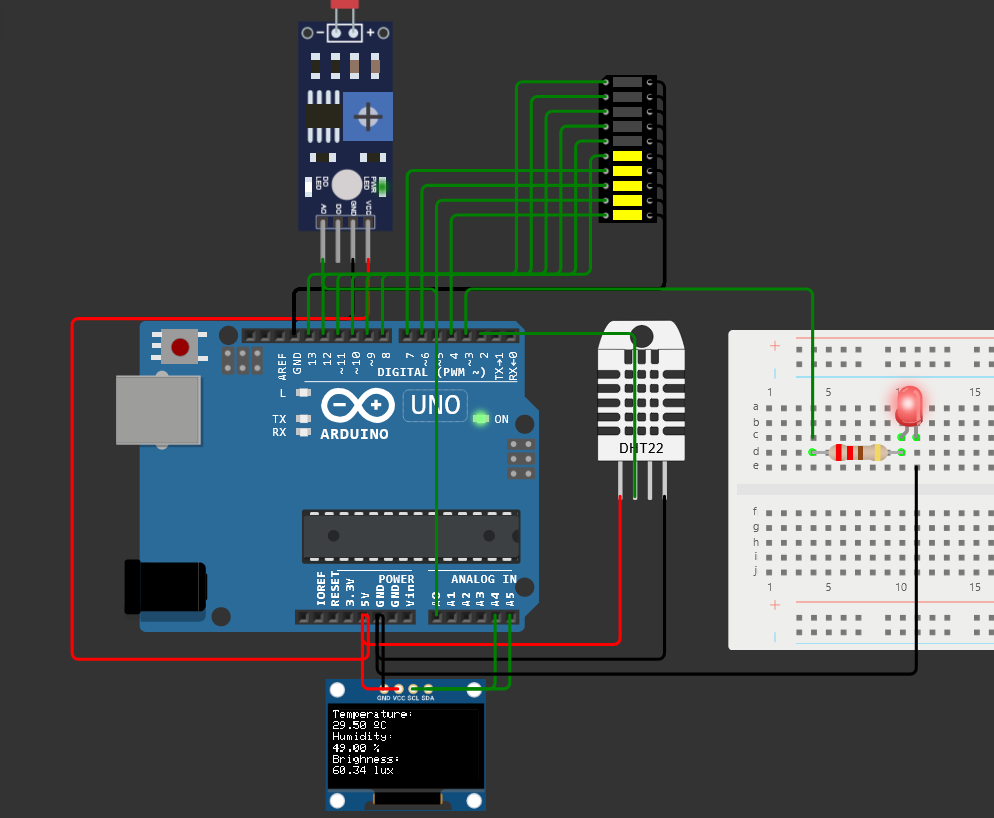
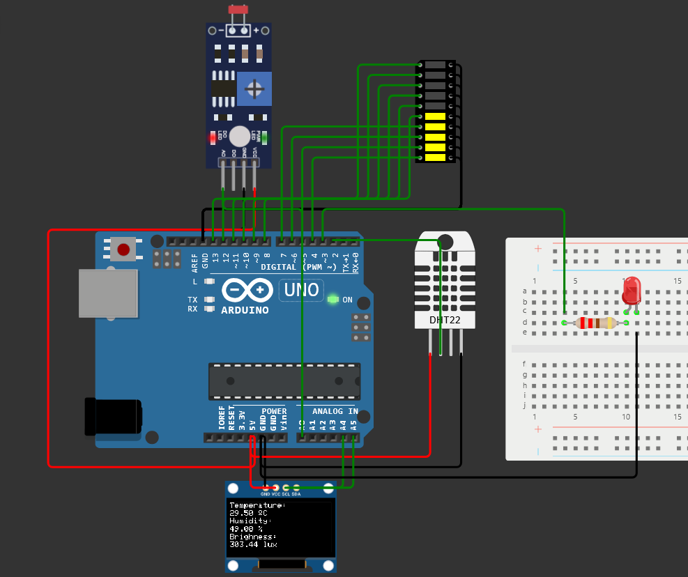

# Arduino Weather Station
In this project, I made a mini weather station that can read real time temperature, humidity and brightness of the surrounding. I used the SSD1306 OLED display to show the temperature, humidity and brightness readings. 

I have used a led bar graph to represent the temperature in a visual way and a led which turns on automatically when the brightness decreases below 300lux. 

This project was simulated using Wokwi Simulator.

## Components Used
1. Arduino UNO R3 x 1
2. DHT22 sensor x 1
3. LDR sensor x 1
4. LED Bar Graph x 1
5. SSD1306 OLED Display x 1
6. LED x 1
7. 220ohm Resistor x 1
8. Breadboard x 1 

## Connections
### Power and Ground Connections:
- **OLED GND** to **Arduino GND** (Black)
- **OLED VCC** to **Arduino 5V** (Red)
- **DHT22 GND** to **Arduino GND** (Black)
- **DHT22 VCC** to **Arduino 5V** (Red)
- **LDR GND** to **Arduino GND** (Black)
- **LDR VCC** to **Arduino 5V** (Red)
- **Bar Graph Common Pins** (C1-C10) to **Arduino GND** (Black)
- **LED Cathode** to **Breadboard Ground** (Connected to Arduino GND)
### Signal Connections:
- **DHT22 SDA** to **Arduino Pin 2** (Green)
- **OLED SDA** to **Arduino A4** (Green)
- **OLED SCL** to **Arduino A5** (Green)
- **LDR AO** to **Arduino A0** (Green)
- **Red LED Anode** to **Breadboard Pin 4t.c** via **Pin 3** of Arduino (Green)
- **LED Bar Graph Pins** (A1-A10):
  - **A1** to **Arduino Pin 13** (Green)
  - **A2** to **Arduino Pin 12** (Green)
  - **A3** to **Arduino Pin 11** (Green)
  - **A4** to **Arduino Pin 10** (Green)
  - **A5** to **Arduino Pin 9** (Green)
  - **A6** to **Arduino Pin 8** (Green)
  - **A7** to **Arduino Pin 7** (Green)
  - **A8** to **Arduino Pin 6** (Green)
  - **A9** to **Arduino Pin 5** (Green)
  - **A10** to **Arduino Pin 4** (Green)
### LED Resistor Connections:
- **Red LED Anode** to **Breadboard Pin 10t.c**
- **Resistor (220 Ohm)** between **Breadboard Pin 4t.d** and **10t.d** 

## Images
 
 
 

